# AgriSarthi: Your AI-Powered Farming Companion

**AgriSarthi** is a revolutionary platform designed to empower farmers with instant, accessible, and accurate agricultural information through a multi-channel approach. Leveraging the power of AI, AgriSarthi provides a comprehensive suite of services through a user-friendly web interface and a simple phone call.

This project aims to bridge the information gap in the agricultural sector, providing farmers with real-time data and expert advice on soil health, crop management, market prices, and government schemes.

-----
## 📺 Demo Video

[](https://youtu.be/o0tapqYnpW4?si=VWNCJLqgt3p-rFH7)

> Click the thumbnail above to watch the full demo on YouTube.
-----

## Architecture

The AgriSarthi platform is built on a modern, scalable, and modular architecture that ensures high performance and maintainability.

```mermaid
graph TB
    %% User Interface Layer
    subgraph UL["🌐 User Interface Layer"]
        direction TB
        WA["🖥️ Web Application<br/>━━━━━━━━━━━━━<br/>• React.js Frontend<br/>• Responsive UI/UX<br/>• Real-time Chat Interface<br/>• 24/7 Accessibility"]
        PC["📞 Voice System<br/>━━━━━━━━━━━━━<br/>• Twilio Voice API<br/>• Speech Recognition<br/>• Text-to-Speech<br/>• Phone Call Integration"]
        WP["💬 WhatsApp Bot<br/>━━━━━━━━━━━━━<br/>• Agri-Sarthi-WP<br/>• Separate Codebase<br/>• Messaging Interface<br/>• Wide Rural Reach"]
    end

    %% API Gateway Layer
    subgraph GL["🚪 API Gateway Layer - FastAPI"]
        direction TB
        AG["⚡ API Gateway<br/>━━━━━━━━━━━━━<br/>• Request Routing<br/>• Load Balancing<br/>• Rate Limiting<br/>• Authentication"]
        
        subgraph ENDPOINTS["📡 Service Endpoints"]
            CE["💬 Chat Endpoint<br/>• REST API<br/>• JSON Response<br/>• Error Handling"]
            VE["🎤 Voice Endpoint<br/>• WebSocket Stream<br/>• Real-time Audio<br/>• Bidirectional"]
            UM["👥 User Management<br/>• Session Handling<br/>• User Profiles<br/>• Analytics"]
        end
    end

    %% AI Processing Layer
    subgraph AL["🧠 AI Processing Core - LangChain & LangGraph"]
        direction TB
        SA["🎯 Supervisor Agent<br/>━━━━━━━━━━━━━━━━━<br/>• Query Classification<br/>• Agent Orchestration<br/>• Response Coordination<br/>• Context Management"]
        
        subgraph AGENTS["🤖 Specialist AI Agents"]
            SCA["🌱 Soil & Crop Advisor<br/>━━━━━━━━━━━━━━━━━<br/>• Soil Health Analysis<br/>• Crop Recommendations<br/>• Weather Alerts<br/>• Farming Techniques<br/>• RAG Implementation"]
            
            MA["📈 Market Analyst<br/>━━━━━━━━━━━━━━━━━<br/>• Real-time Market Prices<br/>• Mandi Rate Tracking<br/>• Price Trend Analysis<br/>• Demand Forecasting<br/>• Supply Chain Insights"]
            
            FA["🏦 Financial Advisor<br/>━━━━━━━━━━━━━━━━━<br/>• Government Schemes<br/>• Subsidy Information<br/>• Loan Guidance<br/>• Financial Planning<br/>• Insurance Advice"]
        end
    end

    %% Data & Services Layer
    subgraph DL["💾 Data & External Services Layer"]
        direction TB
        
        subgraph STORAGE["🗄️ Data Storage"]
            VS["📊 FAISS Vector Store<br/>━━━━━━━━━━━━━━━━━<br/>• Soil Dataset (CSV)<br/>• Embedding Storage<br/>• Similarity Search<br/>• Fast Retrieval"]
        end
        
        subgraph APIS["🔗 External APIs"]
            EA["☁️ Market Data APIs<br/>━━━━━━━━━━━━━━━━━<br/>• Live Price Feeds<br/>• Government Portals<br/>• Weather Services<br/>• Agricultural Databases"]
            
            TA["📞 Twilio API<br/>━━━━━━━━━━━━━━━━━<br/>• Voice Processing<br/>• Call Management<br/>• Media Streaming<br/>• Webhook Integration"]
        end
        
        subgraph MODELS["🚀 AI Models & Processing"]
            LLM["🤖 Groq LLaMA3 LLM<br/>━━━━━━━━━━━━━━━━━<br/>• Fast Inference<br/>• Multi-language Support<br/>• Context Understanding<br/>• Response Generation"]
            
            STT["🎤 Speech Processing<br/>━━━━━━━━━━━━━━━━━<br/>• Real-time Transcription<br/>• Voice Synthesis<br/>• Audio Streaming<br/>• Language Detection"]
        end
    end

    %% Infrastructure Layer
    subgraph IL["🏗️ Infrastructure & DevOps"]
        direction LR
        NG["🔗 Ngrok Tunnel<br/>• Local Development<br/>• Webhook Exposure<br/>• HTTPS Tunneling"]
        
        MON["📊 Monitoring<br/>• System Health<br/>• Performance Metrics<br/>• Error Tracking"]
        
        SEC["🔒 Security<br/>• API Authentication<br/>• Data Encryption<br/>• Rate Limiting"]
    end

    %% Connections - User Interface to Gateway
    WA -.->|"HTTPS Requests"| AG
    PC -.->|"Voice Calls"| TA
    WP -.->|"WhatsApp Messages"| AG

    %% Connections - Gateway to Endpoints
    AG --> CE
    AG --> VE
    AG --> UM
    TA -.->|"Webhook"| VE

    %% Connections - Endpoints to AI Core
    CE -->|"Text Query"| SA
    VE -->|"Transcribed Audio"| SA

    %% Connections - Supervisor to Agents
    SA -->|"Route Query"| SCA
    SA -->|"Route Query"| MA
    SA -->|"Route Query"| FA

    %% Connections - Agents to Data Services
    SCA --> VS
    SCA --> EA
    SCA --> LLM
    MA --> EA
    MA --> LLM
    FA --> EA
    FA --> LLM

    %% Voice Processing Connections
    VE --> STT
    STT --> LLM
    LLM -.->|"Audio Response"| VE

    %% Infrastructure Connections
    VE -.-> NG
    AG -.-> MON
    AG -.-> SEC

    %% Dark Mode Optimized Styling
    classDef uiLayer fill:#1a365d,stroke:#63b3ed,stroke-width:3px,color:#ffffff
    classDef gatewayLayer fill:#44337a,stroke:#b794f6,stroke-width:3px,color:#ffffff
    classDef aiLayer fill:#1c4532,stroke:#68d391,stroke-width:3px,color:#ffffff
    classDef dataLayer fill:#744210,stroke:#f6ad55,stroke-width:3px,color:#ffffff
    classDef infraLayer fill:#742a2a,stroke:#fc8181,stroke-width:3px,color:#ffffff
    
    classDef agentBox fill:#2d5a3d,stroke:#48bb78,stroke-width:2px,color:#ffffff
    classDef endpointBox fill:#553c9a,stroke:#9f7aea,stroke-width:2px,color:#ffffff
    classDef serviceBox fill:#9c4221,stroke:#ed8936,stroke-width:2px,color:#ffffff

    %% Apply styles
    class UL uiLayer
    class GL gatewayLayer
    class AL aiLayer
    class DL dataLayer
    class IL infraLayer
    
    class SCA,MA,FA agentBox
    class CE,VE,UM endpointBox
    class VS,EA,TA,LLM,STT serviceBox

    %% Global Dark Mode Theme Configuration
    %%{init: {"theme": "dark", "themeVariables": {"primaryColor": "#1f2937", "primaryTextColor": "#ffffff", "primaryBorderColor": "#4b5563", "lineColor": "#9ca3af", "secondaryColor": "#374151", "tertiaryColor": "#4b5563", "background": "#111827", "mainBkg": "#1f2937", "secondBkg": "#374151", "tertiaryBkg": "#4b5563"}}}%%

```



-----

## How It Works

AgriSarthi utilizes a sophisticated multi-agent AI system to provide specialized advice to farmers. The system is accessible through two primary channels: a web application and a voice call system.</br>
</br>

</br>
### Web System

The web application provides a simple and intuitive chat interface where farmers can ask questions in their natural language.

1.  **User Interaction**: The farmer types a query into the chat interface built with **React.js**.
2.  **API Request**: The frontend sends the user's message to the **FastAPI** backend.
3.  **AI Processing**:
      * The query is received by the **Supervisor Agent**, which is the entry point of our AI core built with **LangGraph**.
      * The Supervisor Agent analyzes the query and routes it to the appropriate specialist agent:
          * **Soil & Crop Advisor**: Handles queries related to soil health, crop recommendations, farming techniques, and weather alerts. This agent uses a **RAG (Retrieval-Augmented Generation)** system with a **FAISS vector store** to provide information based on a comprehensive soil dataset (`soildata.csv`).
          * **Market Analyst**: Provides real-time market prices, mandi rates, and price trends by fetching data from external APIs.
          * **Financial Advisor**: Offers information on government schemes, subsidies, loans, and financial planning for farmers.
      * The specialist agents use the powerful and fast **Groq LLaMA3 LLM** to generate accurate and context-aware responses.
4.  **Response to User**: The generated response is streamed back to the user in the chat interface.

### Call System

For farmers who may not have access to a smartphone or the internet, AgriSarthi offers a voice call system powered by **Twilio**.

1.  **Incoming Call**: A farmer calls a designated Twilio phone number.
2.  **Twilio Webhook**: Twilio receives the call and sends a request to the FastAPI backend's `/voice/incoming-call` webhook, which is exposed to the internet using **ngrok**.
3.  **WebSocket Connection**: The backend responds with TwiML instructions to establish a real-time, bidirectional media stream over a WebSocket connection.
4.  **Real-time Processing**:
      * The farmer's speech is streamed to the backend.
      * The audio is transcribed to text in real-time.
      * The transcribed text is then processed by the same AI agent system as the web application.
      * The AI's text response is converted back to speech.
5.  **Voice Response**: The synthesized speech is streamed back to the farmer over the phone call, providing an interactive voice-based assistant.

-----

## Three-Prong Approach

AgriSarthi is designed with a three-prong approach to ensure maximum accessibility for all farmers:

1.  **Web Access**: A modern, responsive web application for users with smartphones and internet access.
2.  **Phone Access**: A simple phone call system for farmers with basic feature phones, making the service universally accessible.
3.  **WhatsApp Access**: The architecture is designed to integrate with WhatsApp, which is a widely used communication platform in India. **Please note that the WhatsApp integration is handled in a separate codebase named `Agri-Sarthi-WP`.**

-----

## Cost-Benefit Analysis & Advantages

AgriSarthi offers significant advantages over traditional systems of information dissemination in agriculture.

| Feature             | Traditional System                                       | AgriSarthi                                                               |
| ------------------- | -------------------------------------------------------- | ------------------------------------------------------------------------ |
| **Accessibility** | Limited to specific hours, locations, and personnel.     | 24/7 availability from anywhere with a phone or internet connection.      |
| **Cost** | High costs associated with travel, and expert consultation. | Minimal to no cost for the farmer, leveraging low-cost internet and calls. |
| **Information Quality** | Information can be outdated or generalized.              | Real-time, personalized, and data-driven advice.                         |
| **Scalability** | Difficult to scale and reach a large number of farmers.   | Highly scalable, capable of serving millions of farmers simultaneously.  |

**Approximate Cost-Benefit:**

  * **Cost**: The operational cost of AgriSarthi is primarily driven by API usage (Twilio, Groq, Google Cloud/GenAI) and server hosting. By using efficient models and services, the cost per query can be kept extremely low.
  * **Benefit**: Farmers can experience increased crop yields, better market prices, and access to beneficial government schemes, leading to a significant increase in their income. This also leads to better resource management and more sustainable farming practices.

-----

## Getting Started

Follow these instructions to set up and run the AgriSarthi project locally.

### Prerequisites

  * **Node.js and npm**: For running the frontend.
  * **Python 3.12+**: For running the backend.
  * **Twilio Account**: With a phone number to set up the voice call system.
  * **ngrok**: To expose your local backend to the internet for Twilio webhooks.
  * **API Keys**:
      * `GROQ_API_KEY`
      * `TAVILY_API_KEY`
      * `GOOGLE_API_KEY`
      * `SARVAM_API_KEY` (if applicable)
      * `TWILIO_ACCOUNT_SID`
      * `TWILIO_AUTH_TOKEN`
      * `TWILIO_PHONE_NUMBER`

### Backend Setup

1.  **Clone the repository**:

    ```bash
    git clone <repository_url>
    cd agri_sarthi_project/backend
    ```

2.  **Create a virtual environment and activate it**:

    ```bash
    python -m venv venv
    source venv/bin/activate  # On Windows, use `venv\Scripts\activate`
    ```

3.  **Install dependencies**:

    ```bash
    pip install -r requirements.txt
    ```

4.  **Create a `.env` file** in the `backend` directory and add your API keys:

    ```env
    GROQ_API_KEY="your_groq_api_key"
    TAVILY_API_KEY="your_tavily_api_key"
    GOOGLE_API_KEY="your_google_api_key"
    SARVAM_API_KEY="your_sarvam_api_key"
    TWILIO_ACCOUNT_SID="your_twilio_account_sid"
    TWILIO_AUTH_TOKEN="your_twilio_auth_token"
    TWILIO_PHONE_NUMBER="your_twilio_phone_number"
    NGROK_URL="your_ngrok_url"
    ```

5.  **Run the backend server**:

    ```bash
    uvicorn main:app --reload --host 0.0.0.0 --port 8000
    ```

### Frontend Setup

1.  **Navigate to the frontend directory**:

    ```bash
    cd ../frontend
    ```

2.  **Install dependencies**:

    ```bash
    npm install
    ```

3.  **Start the frontend development server**:

    ```bash
    npm start
    ```

    The web application will be available at `http://localhost:3000`.

### Twilio and Ngrok Setup

1.  **Start ngrok** to expose your local backend server:

    ```bash
    ngrok http 8000
    ```

2.  **Copy the ngrok URL** (the one that starts with `https://`) and update the `NGROK_URL` in your `.env` file.

3.  **Configure Twilio**:

      * Go to your Twilio console and navigate to your phone number's configuration.
      * Under "Voice & Fax", set the "A CALL COMES IN" webhook to your ngrok URL followed by `/voice/incoming-call`. For example: `https://<your-ngrok-url>.ngrok.io/voice/incoming-call`.
      * Set the HTTP method to `POST`.

4.  **Save your Twilio configuration**.

You can now call your Twilio phone number to interact with the voice agent.

-----

## Technologies Used

  * **Frontend**: React.js, CSS
  * **Backend**: FastAPI, Python
  * **AI**: LangChain, LangGraph, Groq LLaMA3
  * **Voice**: Twilio
  * **Database**: FAISS (for RAG)

  * **Deployment**: ngrok (for local development)


